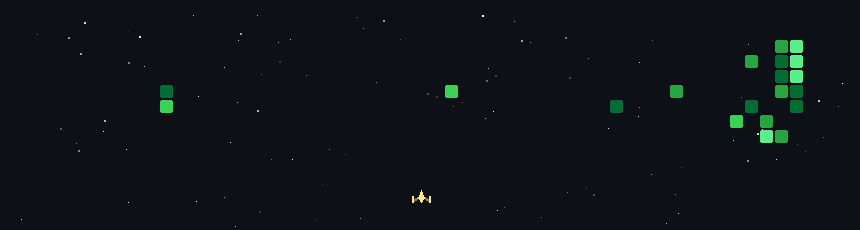

<h1 align="center">🧍‍♂️ Oh, Hi There.</h1>

  

## 🧰 Things I Tinker With

<h3>Languages</h3>

<h3>AI / ML & Data</h3>

<h3>Web / Frameworks</h3>

<h3>Cloud, Databases & Tools</h3>

<h3>Design</h3>

## 📈 Numbers Go Brrr

  
  

  

## 📬 Say Hi

&nbsp;&nbsp;
&nbsp;&nbsp;
&nbsp;&nbsp;

## 💥 Pew Pew

  

